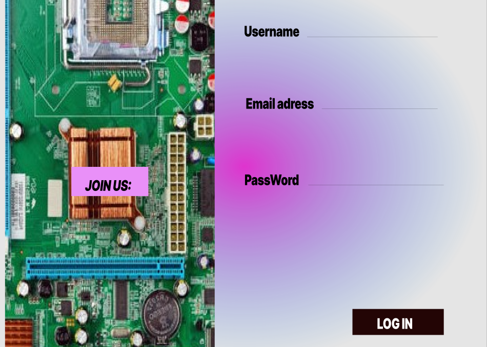

# webpage-repository

school project
README.md

- [webpage-repository](#webpage-repository)
  - [1) Introduction](#1-introduction)
  - [2) Objectives](#2-objectives)
  - [3) Users](#3-users)
  - [4) Functional requirements](#4-functional-requirements)
  - [5) Software Design Description](#5-software-design-description)
    - [a) User Interface Design](#a-user-interface-design)
    - [b) Homepage](#b-homepage)
    - [c) Authentication pages](#c-authentication-pages)
    - [d) Database design](#d-database-design)
      - [Users table](#users-table)
      - [Staff module](#staff-module)
      - [Copmuter module tables](#copmuter-module-tables)
      - [Computer parts table](#computer-parts-table)

## 1) Introduction

The system is all about enabling computer owners know what components their computers have and a vivid description of each hardware component with their respective prices, the system will also help them find the accumulated price for the components they have picked by adding them all together, the system will also help in reventing future scamming to the customers by computer technicians who often overcharge or sell the customer a computer part that is not compatible with the computers they have just because it comes with a higher price point

## 2) Objectives

1. To create a system that will be able to provide a thorough explanation on computer parts together with their respective pictures and design
2. To create a system that adds all the products that will calculate the price of that when the users intend to buy these items they wont be easily scammed because they know just how much these products cost
3. To create a module where users will be able to place any questions that they may be having and will get a reply as soon as possible
4. To create a module that will indicate the items that were purchased through out the visit

## 3) Users

The system will appeal to anyone looking to repair or upgrade their computers, but more so for home based personal computers so as to make customer feedback more helpful

## 4) Functional requirements

1)Authentication module-------
-Sign in-Users are be able to sign in to sign in with their email address and create a password

2)Customer interaction module--------
-This module allows system users to leave their feedback to the feedback section that the staff will be able to see and respond to, then the customer will also be able to see the response to their feedback by the staff from their account

3)Staff module
-From here the staff will be able to see customer feedback and respond to them, the staff will also have the ability to block a system user and also has the access to what items have been sold

## 5) Software Design Description

### a) User Interface Design

-Software design description contains a prototype of how the webpage will look like once it has been completed

### b) Homepage

-The homepage will contain the following:

1. Navigation bar
2. Jumbotron
3. Descriptions
4. Services

### c) Authentication pages

-Here the user will be authenticated by being asked about their login information and sign in request

1. Sign in
2. Log in
3. Log out

### d) Database design

Contains the database table

#### Users table

| Column1        | Data Type  |
| -------------- | ---------- |
| First_name     | small text |
| Last name      | small text |
| Password       | int(PK)    |
| E-mail address | Varchar    |
| Username       | Varchar    |

#### Staff module

The staff module will contain the priviledges that
will allow them to
make changes to the contents of the webpage
database
Column1| Data Type |
|-------------|------------|  
 |First_name | small text |
| Last name | small text |
| Password | int(PK) |
|E-mail address| Varchar |

#### Copmuter module tables

| Manufacturer | Model | Price  |
| ------------ | ----- | ------ |
| Dell         | N5050 | 25,000 |

#### Computer parts table

Parts | Model | CPU | Storage | RAM | Screen
| Dell | N5050 | Core i3 2nd gen 2ghz | 500 gb SATA HDD | 6GB RAM DDR3 1333 MHZ | 15.6 inch 1366*768
| HP | Spectre 15 | | 512 gb SDD | 32GB RAM DDR4 | 15.6 inch 3840*2160

<meta charset="utf-8">
<meta name="viewport" content="width=device-width, initial-scale=1">
<!doctype html>
<html lang="en">
  <head>
   
    <meta charset="utf-8">
    <meta name="viewport" content="width=device-width, initial-scale=1">

    <link href="./bootstrap-5.0.2-dist/css/bootstrap-grid.min.css"rel="stylesheet"/>

    <title>Hello, world!</title>

  </head>tables
  <body>
    

      <nav class="navbar navbar-expand-lg navbar-light bg-light">
        

          <a class="navbar-brand" href="#">Navbar</a>
          <button 
          class="navbar-toggler" 
          type="button" 
          data-bs-toggle="collapse"
           data-bs-target="#navbarSupportedContent" 
           aria-controls="navbarSupportedContent" 
           aria-expanded="false"
            aria-label="Toggle navigation">
            
          </button>
          

            <ul class="navbar-nav me-auto mb-2 mb-lg-0">
              <li class="nav-item">
                <a class="nav-link active" aria-current="page" href="#">Home</a>
              </li>
              <li class="nav-item">
                <a class="nav-link" href="#">Link</a>
              </li>
              <li class="nav-item dropdown">
                <a class="nav-link dropdown-toggle" href="#" id="navbarDropdown" role="button" data-bs-toggle="dropdown" aria-expanded="false">
                  Dropdown
                </a>
                <ul class="dropdown-menu" aria-labelledby="navbarDropdown">
                  <li><a class="dropdown-item" href="#">Action</a></li>
                  <li><a class="dropdown-item" href="#">Another action</a></li>
                  <li>
</li>
                  <li><a class="dropdown-item" href="#">Something else here</a></li>
                </ul>
              </li>
              <li class="nav-item">
                <a class="nav-link disabled" href="#" tabindex="-1" aria-disabled="true">Disabled</a>
              </li>
            </ul>
            <form class="d-flex">
              <input class="form-control me-2" type="search" placeholder="Search" aria-label="Search">
              <button class="btn btn-outline-success" type="submit">Search</button>
            </form>
          

        

      </nav>
    

    <h1>Hello, world!</h1>
    

      

      

        <h1>Column 1</h1>
      

      

        <h1>Column 2</h1>
      

      

        <h1>Column 3</h1>
      

    

    

  </body>
</html>
